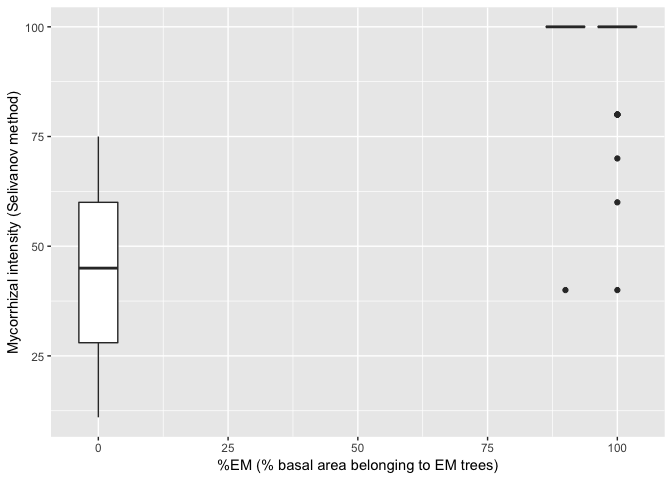

Comparison of Mycorrhizal Intensity Metrics
=========

Clara Qin

12/12/2018


# Background

I am particularly interested in comparing these two metrics.

1. _%EM_ (or _%AM_) - the percent of forest basal area occupied by trees that are associated primarily with ectomycorrhizal (or arbuscular mycorhizal) fungi in a given site.
2. Intensity of mycorrhizal infection - as quantified by methods of Ivan Aleksandrovich Selivanov and described by [Akhmetzhanova _et al._](http://esapubs.org/archive/ecol/E093/059/metadata.htm)

_%EM_ is based on site-level tree characteristics and can therefore be collected relatively easily, whereas intensity of mycorrhizal infection is based on belowground root sampling and therefore requires additional sampling effort.

If _%EM_ and intensity of mycorrhizal infection have a close relationship, then we may conclude that _%EM_ is a sufficient proxy for mycorrhizal infection.

# Analysis

Load mycorrhizal intensity datasets from [Akhmetzhanova _et al._](http://esapubs.org/archive/ecol/E093/059/metadata.htm):


```r
myco <- read.csv("data/sovietunion_myco.csv", header=TRUE) # original name: Myco_db.csv
sites <- read.csv("data/sovietunion_sites.csv", header=TRUE) # original name: Sites.csv
```

Note: I added the _percent.em.trees_ column based on a dataset of tree mycorrhizal associations from Kabir Peay.

See Appendix for dataset schema descriptions.

Clean values for _%EM_:

```r
sites$percent.em.trees <- as.numeric(as.character(sites$percent.em.trees))
```

Combine myco and site datasets:


```r
myco %>%
  filter(mycorrhizal.type.modern=="Ectomycorrhiza ") %>%
  left_join(sites, by=c("site.number"="site")) -> em_sites
```

Plot intensity of ectomycorrhizal infection vs. %EM:


```r
em_sites %>%
  filter(!is.na(percent.em.trees)) %>%
  ggplot(aes(x=percent.em.trees, y=intensity.of.mycorrhizal.infection, group=percent.em.trees)) +
  geom_boxplot()
```

```
## Warning: Removed 13 rows containing non-finite values (stat_boxplot).
```

<!-- -->

Doesn't look so good.

No. of records per %EM level:


```r
em_sites %>%
  group_by(percent.em.trees) %>%
  summarise(n_records = n())
```

```
## # A tibble: 4 x 2
##   percent.em.trees n_records
##              <dbl>     <int>
## 1                0         7
## 2               90         6
## 3              100        92
## 4               NA       541
```

Next steps: Account for mycorrhizal type of the plant from which roots were sampled.

# Appendix

## Site map


## Schema for myco dataset

Number: Unique number of a record

Family: Vascular plant family name according to The Plant List (2010)

Genus: Vascular plant genus name according to The Plant List (2010)

Specific epithet: Vascular plant specific epithet according to The Plant List (2010)

Species: Binomial species name for vascular plant

Original term for mycorrhizal type given by Selivanov: Original term for mycorrhizal type given by Selivanov in his thesis. This field can have any of the following abbreviations:

* ch.ect.: Eumycetic chalmophagic ectomycorrhiza, corresponds to Ectomycorrhiza in modern terminology
* E.t.ect.arb.: Eumycetic tolypophagic ectomycorrhiza (arbutoid), corresponds to Arbutoid in modern terminology
* E.t.ect.er.: Eumycetic tolypophagic ectomycorrhiza (ericoid), corresponds to Ericoid in modern terminology
* E.t.end.: Eumycetic tolypophagic endomycorrhiza (orchid), corresponds to Orchid in modern terminology
* Ecto: Ectomycorrhiza of unidentified type, corresponds to Ectomycorrhiza in modern terminology
* Ecto arbut.: Ectomycorrhiza of arbutoid type, corresponds to Arbutoid in modern terminology
* Ecto er.: Ectomycorrhiza of ericoid type, corresponds to Ericoid in modern terminology
* Endo: Endomycorrhiza of unidentified type, corresponds to Endo-unidentified in this data base
* Endo er.: Endomycorrhiza of ericoid type, corresponds to Ericoid mycorrhiza in modern terminology
* Ph.th.end.: Zygomycetic tamniskophagic endomycorrhiza, corresponds to AM in modern terminology
* Ps.end.: Pseudo-endomycorrhiza, corresponds to DS in modern terminology
* VAM: Vesicular-arbuscular mycorrhiza, corresponds to AM in modern terminology

Modern term for type of mycorrhiza: modern term for type of mycorrhiza according to (Smith S.E. 2009). This field can have any of the following categories:

* AM: arbuscular mycorrhiza
* Arbutoid: arbutoid mycorrhiza
* Ectomycorrhiza: ectomycorrhiza
* Endo-unidentified: non-parasitic fungi found in the root tissue. However they do not create any known type of endo-mycorrhiza
* Ericoid: ericoid mycorrhiza
* DS: dark septate endophyte mycorrhiza
* Orchid: orchid mycorrhiza
* No: non-mycorrhizal plant
* Site number: number of a site where the plant material was collected. The field can have values from 1 to 154. For detailed site description see file sites.txt

Intensity of mycorrhizal infection: value of intensity of mycorrhizal infection measured by the team of Selivanov, ranging from 1 to 100. For the methods to detect the intensity of mycorrhizal infection see under Methods.

Literature data on presence-absence of mycorrhiza: this field is empty for the species-site combinations where the group of Selivanov measured mycorrhizal intensity

"+": indicates that according to the appendix in the thesis of Selivanov (1976) the species was reported in Russian literature as possessing the given type of mycorrhiza at given site

"-": indicates that, according to the appendix in the thesis of Selivanov (1976), in Russian literature the species was reported as non-mycorrhizal at given site

Range of mycorrhizal intensity MIN and Range of mycorrhizal intensity MAX: minimum and maximum values of mycorrhizal intensity measured by Selivanov and his team (when available)

Taxonomy notes: notes on possible inconsistency sources in vascular plant taxonomy

## Schema for sites dataset

Site No.: Unique number of a site of data collection

Climatic zone number: Number of a climatic zone where the site is located, corresponds to the map in Fig. 2

Climatic zone name: Name of a climatic zone where the site is located, corresponds to the map in Fig. 2

Geography: Short verbal description of the site geographical location

Geography details: Detailed verbal description of the site geographical location

Latitude N: Site latitude coordinate (decimal degrees)

Longitude E: Site longitude coordinate (decimal degrees)

Vegetation type: Short description of the vegetation type on the site

Dominant plant species: List of plant species dominant on the site

Soils: Soil type on the site, according to FAO (2003)

Tree species composition: % projected cover of dominant trees on the site

Canopy height: Height of the canopy on the site in cm

Plant cover %: Available data on projected plant cover of the site

Mean tree age: Average age in years of dominant tree species on the site. For the sites situated in mountain forest belts this data is not available. Sites for which the tree age has been set at 0 are not covered by forest.

Forest productivity class: An indication of productivity for forested sites. Range is 1–5; 1 = highest; 5 = lowest. For the sites situated in mountain forest belts this data is not available. Sites for which the productivity is 0 are not covered by forest.
